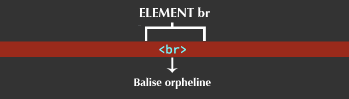
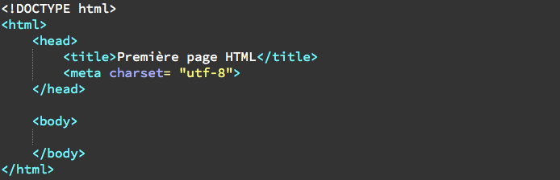
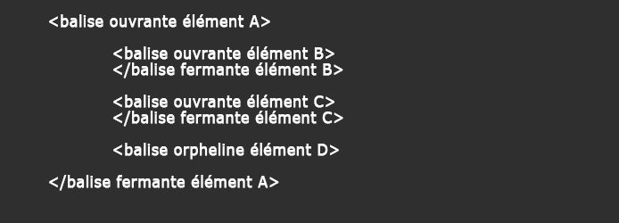

#HTML
L’Hypertext Markup Language, généralement abrégé HTML, est le format de données conçu pour représenter les pages web.

##Les bases en HTML

###Les balises en HTML

Un élément HTML peut être soit constitué d’une paire de balises et d’un contenu, soit (plus rarement) d’une balise unique qu’on dit alors orpheline ou auto-fermante.

L’élément `p` ci-dessous est constitué d’une balise ouvrante, d’un balise fermante (notez la présence du slash), et d'un contenu (textuel) entre les balises.

L’élément `br` ci-dessous (servant à créer un retour à la ligne) n’est lui constitué que d’une balise orpheline.

###Les attributs en HTML

Finalement, la balise ouvrante d’un élément HTML peut contenir des attributs, qui sont parfois même obligatoires.

L’élément `img`, servant à insérer une image dans une page HTML, va lui demander deux attributs : `src` et `alt`.

L'attribut `src` va prendre comme valeur le nom et l’emplacement de l’image tandis que l'attribut `alt` va afficher un texte alternatif dans le cas où l’image ne serait pas disponible (pour les non voyants par exemple).

##Structure

###Structure minimale d’une page en HTML

Vous devez toujours faire votre maximum pour que vos pages de code soient valides. Cela améliorera votre référencement et limitera grandement les problèmes d’ergonomie et les bugs de votre site.

####Le doctype

Tout d’abord, nous devrons toujours démarrer une page HTML en précisant le doctype de notre document. Comme son nom l’indique, le `doctype` sert à préciser le type du document.

####L’élément html

Après le document, nous devons également mentionner un élément `html`. Cet élément est composé de deux balises `<html>` et `</html>` et va représenter notre page HTML en soi.

####Les éléments head et body

L’élément `head` va contenir des meta informations relatives à la page, c’est-à-dire des informations générales dont la page va avoir besoin pour fonctionner, comme le titre de la page ou encore le type d’encodage utilisé.

L’élément `body` va lui contenir tout le contenu « visible » de la page : les textes, images, liens, vidéos, etc.

####Les éléments title et meta

L’élément `title`, qui va contenir le titre de la page et un élément `meta` avec son attribut charset qui va nous permettre de définir l’encodage de la page.

L’encodage est très important pour que tous nos caractères, notamment les accents, s’affichent normalement dans notre page. Pour nous autres, français, nous utiliserons la valeur `utf-8`.

####L’imbrication d’éléments

http://www.w3schools.com/tags/ref_html_dtd.asp
https://www.w3.org/TR/html/
<!--=================== Generic Attributes ===============================-->
	coreattrs

id 			-- document-wide unique id --
class 		-- space-separated list of classes --
style		-- associated style info --
data-*

	i18n

lang		-- language code --
dir			-- direction for weak/neutral text --

	events

onclick     -- a pointer button was clicked --
ondblclick  -- a pointer button was double clicked--
onmousedown -- a pointer button was pressed down --
onmouseup   -- a pointer button was released --
onmouseover -- a pointer was moved onto --
onmousemove -- a pointer was moved within --
onmouseout  -- a pointer was moved away --
onkeypress  -- a key was pressed and released --
onkeydown   -- a key was pressed down --
onkeyup     -- a key was released --

<!--=================== Common tag ===============================-->
<!--=================== Headings =========================================-->
<!--
  There are six levels of headings from H1 (the most important)
  to H6 (the least important).
-->

<h1></h1>

<!--=================== Paragraphs =======================================-->

<!--=================== Images ===========================================-->

src  		-- URI of image to embed --
height      -- override height --
width       -- override width --
alt         -- short description --

<!--================== The LINK Element ==================================-->

<link rel="stylesheet" type="text/css" href="styles.css">
<link rel="icon" type="image/png" href="favicon.png">

href        -- URI for linked resource --
type        -- advisory content type --
rel         -- forward link types --

<!--================== The Anchor Element ================================-->
https://fr.wikipedia.org/wiki/Aide:Lien_ancré_(wikicode)

<a href="#NameId">Link</a>

href        -- URI for linked resource --
target      %FrameTarget;  #IMPLIED  -- render in this frame -- (_blank)

<!--=================== Preformatted Text ================================-->

<pre>Saut à la ligne
	Tabulation
</pre>

<!--================ Forms ===============================================-->

<form action="traitement.php">

</form>

action      %URI;          #REQUIRED -- server-side form handler --
method      (GET|POST)     GET       -- HTTP method used to submit the form--
enctype     %ContentType;  "application/x-www-form-urlencoded" || "multipart/form-data"

<!-- Each label must not contain more than ONE field -->
<label for="NameId">LabelInput</label>

for         IDREF          #IMPLIED  -- matches field ID value --

<input type="(text | password | checkbox | radio | submit | reset | file | hidden)">
<!-- attribute name required for all but submit and reset -->

type        %InputType;    TEXT      -- what kind of widget is needed --
name        CDATA          #IMPLIED  -- submit as part of form --
value       CDATA          #IMPLIED  -- Specify for radio buttons and checkboxes --
checked     (checked)      #IMPLIED  -- for radio buttons and check boxes --
disabled    (disabled)     #IMPLIED  -- unavailable in this context --
tabindex    NUMBER         #IMPLIED  -- position in tabbing order --
onfocus     %Script;       #IMPLIED  -- the element got the focus --
onblur      %Script;       #IMPLIED  -- the element lost the focus --
onselect    %Script;       #IMPLIED  -- some text was selected --
onchange    %Script;       #IMPLIED  -- the element value was changed --

<select>
	<optgroup label="NameOptgroup">
		<option>Element 1</option>
		<option>Element 2</option>
	</optgroup>
	<option>Element 1</option>
	<option>Element 2</option>
</select>

-- select --
name        CDATA          #IMPLIED  -- field name --
multiple    (multiple)     #IMPLIED  -- default is single selection --
disabled    (disabled)     #IMPLIED  -- unavailable in this context --
onfocus     %Script;       #IMPLIED  -- the element got the focus --
onblur      %Script;       #IMPLIED  -- the element lost the focus --
onchange    %Script;       #IMPLIED  -- the element value was changed --
tabindex    NUMBER         #IMPLIED  -- position in tabbing order --

-- optgroup --
disabled    (disabled)     #IMPLIED  -- unavailable in this context --
label       %Text;         #REQUIRED -- for use in hierarchical menus --

-- option --
selected    (selected)     #IMPLIED
disabled    (disabled)     #IMPLIED  -- unavailable in this context --
label       %Text;         #IMPLIED  -- for use in hierarchical menus --
value       CDATA          #IMPLIED  -- defaults to element content --

<textarea></textarea>

name        CDATA          #IMPLIED
rows        NUMBER         #REQUIRED
cols        NUMBER         #REQUIRED
disabled    (disabled)     #IMPLIED  -- unavailable in this context --
tabindex    NUMBER         #IMPLIED  -- position in tabbing order --
onfocus     %Script;       #IMPLIED  -- the element got the focus --
onblur      %Script;       #IMPLIED  -- the element lost the focus --
onselect    %Script;       #IMPLIED  -- some text was selected --
onchange    %Script;       #IMPLIED  -- the element value was changed --

src         %URI;          #IMPLIED  -- URI for an external script --
type        %ContentType;  #REQUIRED -- content type of script language --

<!-- generic metainformation -->

<meta name="SKYPE_TOOLBAR" content="SKYPE_TOOLBAR_PARSER_COMPATIBLE">
<meta charset="utf-8">

http://www.alsacreations.com/astuce/lire/48-commentaires-conditionnels.html

<!--[if IE]>
    <link type="text/css" rel="stylesheet" href="styles-ie.css">
<![endif]-->
